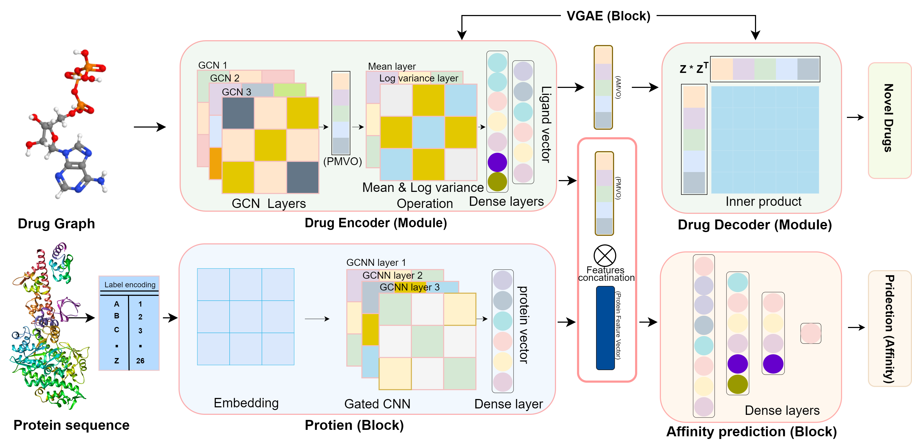

# GraphVAE-DTA
## 💡 Description
This is the implementation of GraphVAE-DTA, which is composed of Variational Graph AutoEncoder (Graph-VAE) and Gated Convolutional Neural Network (Gated-CNN), and fully connected layers (regression block). The GraphVAE-DTA predicts the drug-target interactions with the least error rate than the baseline and generates new variants of drugs with high affinity to existing proteins. The proposed model takes advantage of Graph-VAE to extract features from graph data (i.e., drug) while Gated-CNN handles the target protein sequences. Since the model performs two tasks (i-e, affinity prediction, and novel drugs generation) simultaneously under the multitask learning environment. Such environments typically suffer from optimization issues such as conflicting gradients. Therefore we also introduced and integrated the Fetter Gradients (FetterGards) optimization model into our model to address this concern—the FetterGards algorithm successfully mitigates any potential conflicts that may arise among the task gradients during training.

## 📋 Table of Contents
1. [💡 Description](#description)  
2. [🔍 Dataset](#dataset)  
3. [🧠 Model Architecture](#model-architecture) 
4. [📁 Source codes](#sourcecode) 
5. [⚙️ Installation and Requirements](#installation)   
6. [🤖🎛️ Training](#training)  
7. [📊 Results](#results)  
8. [🥇 Contribution](#contribution)  
9. [📧 Contact](#contact)  
10. [🙏 Acknowledgments](#acknowledgments)  


## 🔍 Datasets:
### Dataset Source:
The dataset files were downloaded from https://github.com/hkmztrk/DeepDTA/tree/master/data
### Description:
**Davis**    
+ **DAVIS dataset:**  
Davis dataset has the following files:
Labels (Y), ligands_can.txt, and proteins.txt which are located in the data/davis/ directory.  
test_fold_setting1.txt, train_fold_setting1.txt which are located in the data/davis/folds/ directory.  
**KIBA**   
+ **KIBA dataset:**
KIBA dataset has the following files
Labels (Y), ligands_can.txt, and proteins.txt which are located in the data/kiba/ directory.  
test_fold_setting1.txt, train_fold_setting1.txt which are located in the data/kiba/folds/ directory.  
### Preprocessing:
During the dataset preprocessing phase, we merged the training data from 5 folds into a CSV file (i.e.,dataset_train.csv). Similarly, we created another CSV file (i.e.,dataset_test.csv) from the test-fold as the testing set. Afterwards, we converted these CSV files into PyTorch format.
### Dataset Size:
**Davis size**
+ The Davis dataset consists of a total of 30056 interactions.
+ The training set of Davis is consists of a total 25042 interactions
+ The testing set of Davis is consists of a total 5010 interactions  
**Davis size**
+ The KIBA dataset consists of a total of 118254 interactions.
+ The training set of KIBA is consists of a total 98545 interactions
+ The testing set of KIBA is consists of a total 19709 interactions   
### Sample Entry:
+ **Sample ID:** 12345  
+ **Drug SMILES:** CC(=O)Nc1cnc2[nH]cnc2c1N  
+ **Target Protein Sequence:** MGGKQDKIYLVLENGKTLKFPMILYGMLVYKLLNKFRNEEYDVLDKILEKKDGNFIMKVKNGKLCDLFIFSKKDINPN  
+ **Affinity Value (pKd):** 7.82  

## 🧠 Model Architecture
The GraphVAE-DTA architecture for drug discovery generally consists of the following components:

1. 💊⚛️ **Drug Encoder**: The Drug Encoder, denoted as q(Z|X,A), is designed to process graph data represented by node feature vectors X and adjacency matrix A. The input data is organized in mini-batches of size 
[batch_size, Drug_features], where each drug is characterized by its feature vector.The goal of the Drug Encoder is to transform this high-dimensional input into a lower-dimensional representation. Typically, the Drug Encoder employs a multivariate Gaussian distribution to map the input data points (X, A) to a continuous range of possible values between 0 and 1. This results in novel features that are derived 
from the original drug features, providing a new representation of each drug. However, when dealing with affinity prediction, it is necessary to keep the actual representation of the input drug to make accurate predictions. Thus, we utilized the Drug Encoder to yield a pair of outputs as follows  

 (I): For the affinity prediction task, we use the features obtained prior to the mean and log variance operation (PMVO). These features are more appropriate for predicting drug affinity, as they retain the original characteristics of the input drug without being altered by the AMVO process.

(II): For novel drug generation, we utilize the feature obtained after performing the mean and log variance operation (AMVO). This feature captures the Underlying of the input drug and is suitable for generating new drug compounds.  

2. 💊 **Drug Decoder**: The Drug Decoder p(Drug|Z_i, Z_j) uses latent space (AMVO) and generates the probability of adjacency matrix for newly generated drugs. This probability of the adjacency matrix shows the possibilities of connections between newly generated nodes of drugs.  

3. 🔄 **Gated-CNN for Target-Proteins**: The Gated Convolutional Neural Network (GCNN) block is specifically designed to extract the features of amino acid sequences. The GCNN takes the protein sequences in the form of the embedding matrix, where each amino acid is represented by 128 feature vectors. The Gated-CNN internally splits the word embedding matrix into two parts, which are then passed through the CV-Unit and GV-Unit. The final output (extracted features) is produced by taking the element-wise product of the CV-Unit and GV-Unit. For more detail, please visit the paper.

4. 🎯 **Prediction (AP-BLOCK)**: Our model's prediction block utilizes the extracted features from both the Drug Encoder (PMVO) and GCNN for target proteins. These features are concatenated and then passed through the designed architecture for predicting affinity.



## 📁 Source codes:
The whole implementation of GraphVAE-DTA is based on PyTorch.  

+ create_data.py: This script generates data in PyTorch format.   
+ utils.py: This particular module offers a range of helpful functions and classes that are utilized by other scripts present in the codebase. One such class is the TestbedDataset, used explicitly by create_data.py to create data in PyTorch format.  
+ training.py: This module will train the GraphVAEDTA model.
+ models.py: Proposed Model. 
+ FetterGrads.py: This script FetterGrad.py is the implementation of Fetter Gradients algorithm .  
+ test.py: The script test.py can be used the test the saved models on test set.  

## ⚙️ Installation and Requirements
You  need to run the following commands in order to run the codes
```sh
conda env create -f environment.yml  
```
it will download all the required libraries

Or install Manually...
```sh
conda create -n GraphVAEDTA python=3.8
conda activate GraphVAEDTA
+ python 3.8.11
+ conda install -y -c conda-forge rdkit
+ conda install pytorch torchvision cudatoolkit -c pytorch
```
```sh
pip install torch-cluster==1.6.0+pt112cu102
```
```sh
pip install torch-scatter==2.1.0+pt112cu102
```
```sh
 pip install torch-sparse==0.6.16+pt112cu102
```
```sh
pip install torch-spline-conv==1.2.1+pt112cu102
```
```sh
pip install torch-geometric==2.2.0
```


## 🤖🎛️ Training
The GraphVAE-DTA is trained using PyTorch and PyTorch Geometric libraries, with the support of NVIDIA GeForce RTX 2080 Ti GPU as the back-end hardware.

i.Create Data
```sh
conda activate GraphVAEDTA
python create_data.py
```
The create_data.py script generates four CSV files: kiba_train.csv, kiba_test.csv, davis_train.csv, and davis_test.csv. These files will be saved in the data/ folder and used as input to generate PyTorch-formatted data. Further, the PyTorch-formatted data will be stored at data/processed/, consisting of  kiba_train.pt, kiba_test.pt, davis_train.pt, and davis_test.pt.

ii. Train the model 
```sh
conda activate GraphVAEDTA
python training.py 0 0
```
To specify the dataset, use the first argument where 0 represents 'Davis' and 1 represents 'KIBA'. For the Cuda index, use the second argument where 0, 1, 2, and 3 represent cuda:0, cuda:1, cuda:2, and cuda:3, respectively.

## 📊 Results

###Davis  
Table 1: The performance (results) of proposed model on Davis dataset under the respective metrics 
| Model        | MSE                 | CI                  | RM2                 | PCC                 | RC                  |
|--------------|---------------------|---------------------|---------------------|---------------------|---------------------|
| GraphVAE-DTA | 0.205               | 0.890               | 0.719               | 0.857               | 0.190               |


###KIBA
Table 2: The performance (results) of proposed model on KIBA dataset under the respective metrics
| Model       | MSE                 | CI                  | RM2                 | PCC                 | RC                  |
|-------------|---------------------|---------------------|---------------------|---------------------|---------------------|
| GraphVAE-DTA| 0.130               | 0.905               | 0.802               | 0.900               | 0.240               |


 
  


## 🥇 Contribution
The main contribution of our study are outlined below.  
I. The porposed model offers two functions (affinity prediction and novel drug generation)  
II. We considered a natural representation of drugs in the form of graphs with a comprehensive set of atom features.  
III. Dealing with the Multi-Task Learning environment (MTL), we introduced the FetterGards optimization algorithm to tackle the general challenges of MTL, such as conflicting gradients.  
IV. The proposed model achieved the least Means Square Error in the affinity prediction task compared to the previous baseline models.   

## 📧 Contact
Have a question? or suggestion Feel free to reach out to me!.  

**📨 Email:** [pirmasoomshah@gmail.com](pirmasoomshah@gmail.com)  
**🌐 Webpage:** [Pir Masoom Shah](https://sites.google.com/view/pirmasoomshah)

## 📜 Reference
paper reference

